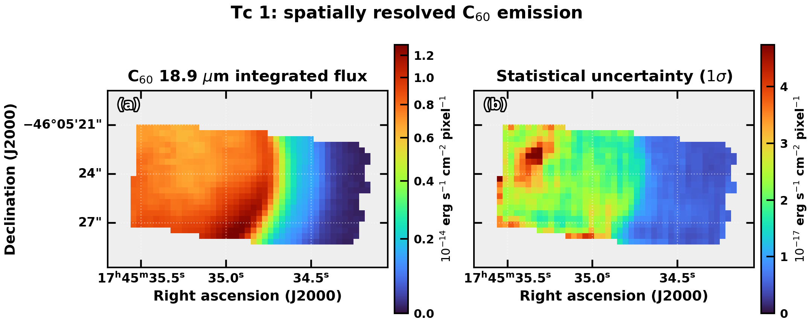
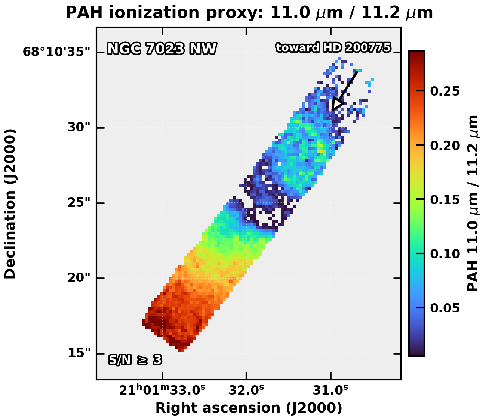

# JAFA: JWST Aromatic Feature Analyzer


JAFA creates continuum-subtracted spectral-feature maps and feature-ratio maps
from JWST integral-field spectroscopy cubes. It is designed for spatially
resolved PAH and fullerene studies, with its current feature database centered
on MIRI MRS data. Feature windows, continuum constraints, and processing
settings are defined in YAML so that each analysis is inspectable and
reproducible.

Scientific validation and citation guidance will accompany Arun et al. (in
preparation). Until then, publications using JAFA should cite the software
version or commit and report the feature definition and map settings used.

## Capabilities

- Load JWST `s3d` FITS products with science, uncertainty, DQ, WMAP, WCS, and
  pixel-area information.
- Fit morphology-assisted spline continua using configurable anchor windows
  and anchor wavelengths.
- Integrate PAH, fullerene, or user-defined residual features into
  WCS-preserving FITS maps.
- Reject map-edge artifacts using feature-specific spectral coverage, DQ,
  WMAP, and footprint-erosion criteria.
- Stitch adjacent spectral cubes on a conservative common spatial footprint
  when a feature and its continuum constraints cross sub-band boundaries.
- Build ratio maps on the coarser input grid with propagated uncertainty and
  intersected science masks.
- Write exact frequency-integrated cgs products, diagnostic figures, mask
  products, and YAML provenance metadata.

## Example Products

TC 1 C60 18.9 um continuum diagnostic:



NGC 7023 PAH 11.0/11.2 ratio map:



## Installation

Install the core package:

```bash
python -m pip install jafa
```

Install the dependencies used by the complete JWST mapping workflow:

```bash
python -m pip install "jafa[jwst,plot]"
```

For development from a local checkout:

```bash
conda env create -f environment.yml
conda activate jafa
python -m pip install -e ".[jwst,plot,test,docs,dev]"
```

JAFA requires Python 3.10 or later. The core dependencies are NumPy, SciPy,
Astropy, and PyYAML. Optional workflow dependencies are imported only by the
operations that require them.

## Quick Start

Create a feature map from one or more cubes:

```bash
jafa make-map \
  --cubes cube1.fits cube2.fits \
  --feature C60_18p9 \
  --outdir results/c60_18p9
```

Create a ratio map:

```bash
jafa make-ratio \
  --cubes cube1.fits cube2.fits cube3.fits \
  --feature1 PAH_11p0 \
  --feature2 PAH_11p2 \
  --outdir results/pah_ratio
```

Use an explicit integration window and continuum anchors:

```bash
jafa make-map \
  --cubes cube.fits \
  --wavelength 18.9 \
  --feature-window 18.82 19.02 \
  --anchors 18.55 18.70 19.15 19.30 \
  --outdir results/custom_18p9
```

The same workflow is available through Python:

```python
from jafa import FeatureMapper

mapper = FeatureMapper(["cube1.fits", "cube2.fits"])
mapper.make_feature_map("C60_18p9", outdir="results/c60_18p9")
mapper.make_ratio_map("PAH_11p0", "PAH_11p2", outdir="results/pah_ratio")
```

## Configuration

Pipeline settings can be supplied with `--config`. A complete example is
provided in [`examples/example_config.yaml`](examples/example_config.yaml).
The default science-mask settings are:

```yaml
settings:
  min_feature_coverage: 0.95
  min_required_coverage: 0.95
  min_relative_weight: 0.25
  edge_erosion_pixels: 1
  output_unit: cgs
  allow_cube_stitching: true
  stitch_min_spatial_coverage: 0.95
  stitch_require_common_spatial_footprint: true
```

Important command-line overrides include:

```text
--snr-threshold 3
--morph-half-window 10
--bin-spatial 2
--min-feature-coverage 0.95
--min-required-coverage 0.95
--min-relative-weight 0.25
--edge-erosion-pixels 1
--output-unit cgs
--no-stitch-cubes
--stitch-gap-tolerance 0.01
--stitch-overlap split
--allow-noncommon-stitch-footprint
--no-clip-negative
```

## Feature Definitions

Built-in definitions are stored in
[`src/jafa/data/features.yaml`](src/jafa/data/features.yaml). Each entry
specifies the feature center, integration window, continuum method, anchor
constraints, and optional instrument metadata:

```yaml
C60_18p9:
  feature_name: C60_18p9
  central_wavelength: 18.90
  integration_window: [18.75, 19.15]
  continuum_mode: morph_spline
  continuum_anchors: []
  continuum_anchor_points: [17.8, 18.0, 18.2, 18.4, 18.6, 19.2, 19.5, 19.8, 20.2, 20.5]
  notes: Fullerene C60 band.
  preferred_instrument: MIRI MRS
  preferred_channel: Channel 4
```

The bundled database includes `PAH_3p3`, `PAH_6p2`, `PAH_7p7`, `PAH_8p6`,
`PAH_11p0`, `PAH_11p2`, `PAH_12p7`, `PAH_16p4`, `C60_7p0`, `C60_8p5`,
`C60_17p4`, and `C60_18p9`. These definitions are science defaults and should
be reviewed for the target, observing mode, spectral sampling, and neighboring
features. Pass `--feature-db custom_features.yaml` to merge or override them.

## Numerical Method

For each requested feature, JAFA:

1. Selects a cube that covers the integration window and continuum constraints,
   or stitches the narrowest eligible adjacent-cube sequence.
2. Applies finite-value, DQ, and WMAP validity criteria at the voxel level.
3. Estimates a morphology-cleaned baseline and fits a spline through the
   configured continuum anchors for each spatial bin.
4. Subtracts the fitted continuum and integrates samples inside the feature
   window.
5. Applies the feature-specific spatial science mask and optional S/N filter.
6. Writes FITS products with celestial WCS plus diagnostic and provenance files.

The default `morph_spline` continuum suppresses narrow spectral structure with
`pybaselines.morphological.mor` before fitting the anchor-constrained spline.
The default morphology half-window is 10 spectral samples. Automatic endpoint
anchors limit spline excursions at the ends of the fitted wavelength range.

For JWST surface-brightness cubes such as `MJy/sr`, the default `cgs` mode
converts the residual to `erg s-1 cm-2 Hz-1 sr-1`, integrates over the exact
frequency grid, and multiplies by the output-pixel solid angle. The resulting
map unit is `erg s-1 cm-2 pixel-1`. The optional `native` mode instead performs
wavelength integration in the cube's native flux-density units.

Integration uses the cube samples within the feature window and does not
interpolate the residual to exact window boundaries. Integrated statistical
uncertainty uses trapezoid-equivalent weights when an uncertainty cube is
available.

## Edge and Coverage Masks

Map edges in resampled IFU cubes can contain partial spectral support, low
cube-build weight, or non-science pixels that bias a continuum fit or residual
integral. JAFA constructs a separate science mask for every feature:

- Voxels flagged by the JWST `DO_NOT_USE` or `NON_SCIENCE` DQ bits are rejected.
- Non-finite science values and zero or invalid WMAP values are rejected.
- Pixels must retain the configured fraction of valid spectral samples in the
  integration window and across the full feature-plus-continuum span.
- WMAP is normalized by the valid spatial median in each wavelength plane;
  pixels below `min_relative_weight` are rejected.
- The accepted footprint is eroded by `edge_erosion_pixels` to remove its
  unstable outer boundary.

The defaults require 95 percent feature coverage, 95 percent required-span
coverage, a median relative WMAP of 0.25, and one pixel of erosion. These are
conservative general defaults, not universal physical constants. Publication
analyses should inspect the coverage and relative-weight maps, test threshold
sensitivity, and report the adopted values.

Ratio products use the intersection of the numerator and denominator science
masks. Reprojection uses nearest-neighbor transport for masks so invalid pixels
are not numerically blended into valid regions.

## Cube Stitching and Ratios

When a feature crosses adjacent spectral sub-bands, JAFA reprojects spectral
planes onto the coarser spatial grid, removes duplicate overlap samples, and
requires a common input footprint by default. The source cubes, target grid,
overlap policy, and retained footprint fraction are recorded in metadata.

Spatial reprojection is not PSF matching. Ratios or stitched measurements that
combine substantially different wavelengths should be convolved to a common
PSF before quantitative interpretation. JAFA deliberately avoids upsampling
the coarser feature map when creating a cross-grid ratio.

## Outputs

Each feature run can produce:

```text
<feature>_map.fits
<feature>_unc.fits
<feature>_continuum.fits
<feature>_mask.fits
<feature>_coverage.fits
<feature>_relative_weight.fits
<feature>_diagnostic.png
<feature>_metadata.yaml
```

Uncertainty, continuum, and relative-weight products are written when the
required inputs or settings are available. The mask FITS file uses `1` for a
retained science pixel and `0` for a rejected pixel.

Ratio runs additionally produce:

```text
<feature1>_over_<feature2>_ratio.fits
<feature1>_over_<feature2>_ratio_unc.fits
<feature1>_over_<feature2>_mask.fits
<feature1>_over_<feature2>_ratio.png
<feature1>_over_<feature2>_metadata.yaml
```

## Publication Checklist

- Inspect continuum diagnostics and residual spectra for representative source,
  background, and edge pixels.
- Verify feature windows and anchors against the target spectrum and spectral
  resolution.
- Report the JAFA version or commit, feature database, configuration, mask
  thresholds, clipping policy, and any spatial binning.
- Test sensitivity to continuum anchors, morphology scale, edge-mask thresholds,
  and integration-window placement.
- Match the PSF before interpreting cross-wavelength spatial ratios.
- Treat the reported uncertainty as propagated statistical uncertainty; the
  current products do not include continuum-model or calibration systematics.

## Documentation

The user guide covers [configuration](docs/configuration.rst),
[methodology](docs/methodology.rst), [outputs](docs/outputs.rst), and the
[Python API](docs/api.rst).

## Development

Run the project checks with:

```bash
pytest -q
ruff check src tests
tox -e py312
sphinx-build -b html docs docs/_build/html
python -m build
```

## License and Contact

JAFA is distributed under the [MIT License](LICENSE). For scientific questions
or collaboration, contact Arun Roy at `arunroyon@gmail.com`.
